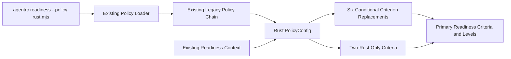

# Architecture Review: Rust Readiness Policy

**Status**: Accepted
**Date**: 2026-07-18
**Feature**: [spec.md](spec.md)
**Security Review**: [sec.md](sec.md)

## Linkage

No separate PRD exists. This review treats `FR-001` through `FR-018` and `SC-001` through `SC-008`
in `spec.md` as the requirements source. It supersedes the earlier canonical-analyzer design.

## Context and Problem Space

The immediate user problem is unfair Rust readiness scoring, not incomplete Cargo analysis. A large
analyzer and cross-surface refactor would be difficult to review and merge as an outside
contribution. AgentRC already supports executable `PolicyConfig` modules that can replace criteria in
the primary legacy readiness path by adding criteria with existing IDs.

The selected architecture therefore delivers one copyable policy example with no production core
changes. Additive core changes and maintainer-owned architecture findings are follow-up work after
002, not coordinated implementation tracks within this feature.

## Driving Requirements

| Requirement   | Architectural implication                                                                  |
| ------------- | ------------------------------------------------------------------------------------------ |
| FR-001-FR-004 | One `.mjs` `PolicyConfig` replaces primary legacy criteria conditionally.                  |
| FR-005-FR-010 | Fixed-path and bounded Rust evidence checks; six replacement IDs and two explicit new IDs. |
| FR-011-FR-015 | Rust remediation, read-only operation, primary-score effect, and normalized compatibility. |
| FR-016-FR-018 | Exact usage/chaining docs, reusable fixtures, and zero production-core changes.            |
| SC-004-SC-005 | Non-Rust fallback behavior and Rust-only skips are mandatory compatibility gates.          |

## Decision Drivers

1. Immediate improvement to the primary readiness result.
2. Zero production-core changes and no public-contract changes.
3. Correct behavior on non-Rust repositories.
4. Direct execution on Node.js 22 without TypeScript tooling.
5. Small, reviewable, independently useful upstream contribution.
6. Honest limitations rather than claims dependent on incomplete analysis.

## Options Considered

### Option 0: Status Quo

Leave Rust readiness results unchanged.

**Rejected**: Delivers no user value.

### Option A: Self-Contained Imperative PolicyConfig Example (Selected)

Add `examples/policies/rust.mjs`, exporting a root-level `PolicyConfig` object. Its `criteria.add`
entries replace six built-in criteria by the same IDs and add two Rust-only criteria. Checks select
Rust behavior only for Rust scopes and otherwise reproduce current built-in behavior.

| Driver                   | Rating                                            |
| ------------------------ | ------------------------------------------------- |
| Primary readiness effect | Good                                              |
| Core-change risk         | Good                                              |
| Non-Rust compatibility   | Good with characterization tests                  |
| Runtime portability      | Good (`.mjs`, Node built-ins only)                |
| Immediate value          | Good                                              |
| Long-term maintenance    | Fair; fallback behavior mirrors current built-ins |

**Why selected**: It is the only zero-core approach that changes the primary readiness score while
preserving non-Rust behavior. A declarative JSON disable would remove criteria unconditionally. A
native lifecycle plugin would currently affect shadow-engine output rather than the primary maturity
result.

### Option B: Additive Core Changes (Follow-Up)

Teach core checkers, remediation, instructions, and eval scaffolding about Rust through separate PRs.

**Deferred**: Valuable after Option A, but explicitly outside 002.

### Option C: Maintainer Reports (Follow-Up)

Report analyzer duplication publicly and handle potential security findings privately through
`SECURITY.md`.

**Deferred**: No report or sensitive reproduction is a deliverable of 002.

## Selected Architecture



## Technical Approach

### Policy Form

| Property      | Decision                                                                         |
| ------------- | -------------------------------------------------------------------------------- |
| File          | `examples/policies/rust.mjs`                                                     |
| Export        | Default root-level object with `name`, `version`, and `criteria.add`             |
| API path      | Existing legacy `PolicyConfig` resolution                                        |
| Imports       | Node.js built-ins only; no AgentRC private-core import                           |
| Invocation    | `agentrc readiness <repo> --policy ./rust.mjs`                                   |
| Configuration | CLI only; executable module policies are not accepted from `agentrc.config.json` |

### Criterion Strategy

| ID                      | Rust behavior                                                  | Non-Rust fallback                                                    |
| ----------------------- | -------------------------------------------------------------- | -------------------------------------------------------------------- |
| `lint-config`           | Clippy config or conservative uncommented Cargo lint header    | Current ESLint/Biome/Prettier candidates and result text             |
| `format-config`         | rustfmt config                                                 | Current Prettier/Biome candidates and result text                    |
| `typecheck-config`      | Root Cargo manifest establishes static type checking           | Current tsconfig/Python candidates and result text                   |
| `build-script`          | Analyzer-detected Rust app has standard Cargo build capability | Current `app.scripts.build` behavior                                 |
| `test-script`           | Analyzer-detected Rust app has standard Cargo test capability  | Current `app.scripts.test` behavior                                  |
| `lockfile`              | Cargo.lock passes; missing pure-Rust lockfile skips            | Current Node lockfile behavior, including mixed repos with Node apps |
| `rust-toolchain-pinned` | Rust-only pass/fail from fixed toolchain candidates            | Skip                                                                 |
| `rust-supply-chain`     | Rust-only pass/fail from fixed deny/audit/vet candidates       | Skip                                                                 |

Replacement criteria preserve current IDs, titles, pillars, levels, scopes, impact, effort, reasons,
and evidence on the non-Rust path. Custom Rust-only IDs are explicit and do not masquerade as
unrelated existing criteria.

### File Access

- Use fixed candidate paths joined to the supplied repository root.
- Reject any candidate that does not resolve beneath the root, even though candidates are constants.
- Use link-aware file metadata to reject symbolic links, non-files, and files larger than 1 MiB
  before reading Cargo content; validate the opened handle before consuming content.
- Read at most one root `Cargo.toml` and strip comment-only lines before conservative table-header
  matching.
- Treat missing, unreadable, malformed, or oversized files as absent evidence without throwing.
- Perform no writes, subprocess calls, dynamic imports, or network operations from checks.

### Policy Chaining

The Rust policy replaces complete criterion definitions, so organization metadata overrides should
be loaded afterward:

```sh
agentrc readiness <repo> --policy ./rust.mjs,./org-baseline.json
```

This preserves documented last-policy-wins semantics. An organization policy may intentionally
override or disable a replacement criterion.

## Constraints and Boundaries

- No changes under `packages/core/`, production `src/`, `plugin/skills/`, or `vscode-extension/`.
- No runtime dependency or lockfile changes.
- No analyzer, criterion-ID, result-envelope, output, or policy-engine changes.
- No instruction, eval, settings, MCP, report, TUI, batch, or extension behavior changes.
- The policy is trusted executable code and must be explicitly supplied through `--policy`.
- Repo-scoped checks cannot prove separate tooling completeness for each ecosystem in mixed repos.
- Incomplete Rust app detection remains an upstream limitation; the policy does not claim to fix it.

## Implementation Guardrails

- **MUST** export a `PolicyConfig`, not a native `PolicyPlugin`.
- **MUST NOT** pair the module with unconditional JSON disables.
- **MUST** replace existing criteria through `criteria.add` using exact IDs.
- **MUST** reproduce current built-in metadata and check outcomes on non-Rust paths.
- **MUST** return `skip` from custom Rust-only criteria on non-Rust repositories.
- **MUST** use `.mjs`; users must not need `tsx` or TypeScript compilation.
- **MUST NOT** import private `@agentrc/core` modules from the example.
- **MUST** keep reads fixed-path, bounded, non-executing, and failure-tolerant.
- **MUST NOT** include private security finding details in committed artifacts.

## Consequences

### Positive

- Rust users can improve primary readiness scoring immediately.
- The contribution is isolated to examples, tests, and documentation.
- Existing policy APIs and output contracts remain unchanged.
- Non-Rust compatibility is directly testable.
- No dependency or production bundle risk is introduced.

### Negative

- The policy duplicates current built-in fallback behavior and must track upstream criterion changes.
- Root-scoped criteria cannot distinguish separate ecosystem coverage in mixed repositories.
- Static checks cannot classify a no-lockfile crate as library versus application.
- Rust-aware instruction and eval generation remain future work.
- Users of the npm package must copy/download the example because examples are not published.

## Risks and Mitigations

| Risk                                       | Mitigation                                                                  |
| ------------------------------------------ | --------------------------------------------------------------------------- |
| Declarative disable weakens non-Rust repos | Do not ship a JSON disable policy; use conditional criterion replacements.  |
| Native plugin changes only shadow score    | Export legacy `PolicyConfig` and assert primary criteria/level changes.     |
| Fallback behavior drifts upstream          | Characterization tests compare replacement metadata/results with built-ins. |
| Large Cargo manifest consumes memory       | Enforce a 1 MiB metadata gate and one bounded read.                         |
| Commented lint table causes false pass     | Ignore comment-only lines before anchored header matching.                  |
| Mixed repo is reported as fully covered    | Document repo-scope limitation and avoid per-ecosystem completeness claims. |
| Org override is lost                       | Document Rust-first, org-last chain ordering.                               |

## Rollback Plan

- Revert the example, its focused tests, and documentation as one isolated change.
- No production migration or feature flag is required.
- Existing repositories stop using the copied policy by removing it from `--policy`.

## Testing Strategy

- Load the `.mjs` file through the same dynamic policy loader used by the CLI.
- Run `runReadinessReport()` with the policy and assert the primary criteria and achieved level.
- Compare normalized built-in and policy reports for Node and Python fixtures.
- Exercise every Rust evidence candidate and remediation path.
- Exercise standalone, workspace, mixed, and no-lockfile cases.
- Verify custom Rust IDs skip on non-Rust repositories.
- Verify Rust-first, organization-last chaining.
- Statically assert no production dependency/lock changes and no process/network/write APIs.

## Traceability Matrix

| Requirements  | Architecture coverage                                               |
| ------------- | ------------------------------------------------------------------- |
| FR-001-FR-004 | Policy form and conditional replacement design                      |
| FR-005-FR-010 | Criterion strategy and bounded evidence probes                      |
| FR-011-FR-015 | Rust remediation, safety guardrails, loader and compatibility tests |
| FR-016-FR-018 | Chaining documentation, fixtures, and zero-core boundary            |
| SC-001-SC-008 | Testing strategy and rollback gates                                 |

## Follow-Up Decisions

- Option B and Option C require separate scopes after 002 is complete.
- Any potential security report remains private and is not described in committed feature artifacts.
