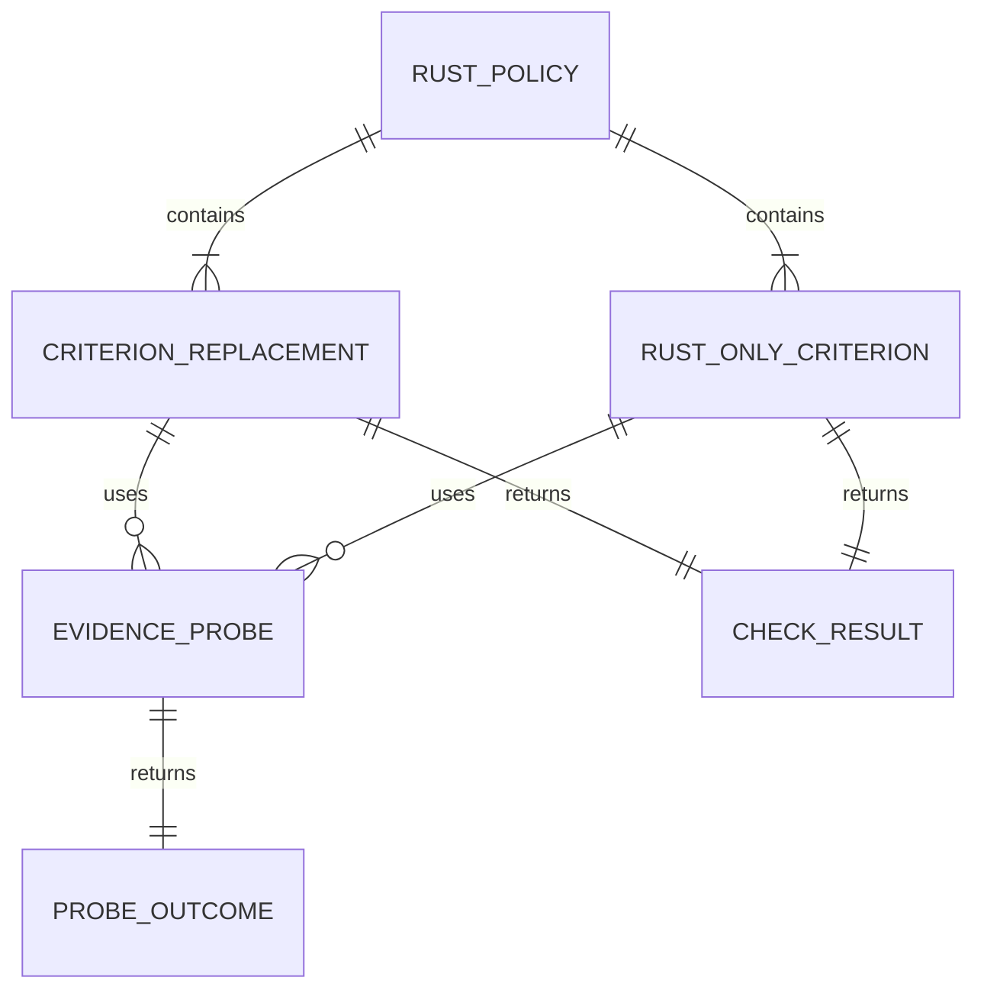

# Data Model: Rust Readiness Policy

**Date**: 2026-07-18
**Feature**: [spec.md](spec.md)

This feature adds no public or persistent data model. The entities below describe the executable
example's internal policy structure and test contracts.

## Entity Relationships



## Rust Policy

One default-exported root-level `PolicyConfig` object.

| Field          | Type            | Required | Validation                                                    |
| -------------- | --------------- | -------: | ------------------------------------------------------------- |
| `name`         | string          |      yes | Stable example name, such as `rust-readiness`.                |
| `version`      | string          |      yes | Documents compatibility with the current example behavior.    |
| `criteria.add` | criterion array |      yes | Contains exactly six replacements and two Rust-only criteria. |

The export must not contain a root `meta` object, lifecycle hooks, detectors, or recommenders that
would classify it as a native `PolicyPlugin`.

## Criterion Replacement

A complete criterion definition using an existing built-in ID.

| Field    | Type                       | Required | Validation                                                     |
| -------- | -------------------------- | -------: | -------------------------------------------------------------- |
| `id`     | existing criterion ID      |      yes | One of the six IDs in FR-003.                                  |
| `title`  | string                     |      yes | Matches current built-in metadata.                             |
| `pillar` | readiness pillar           |      yes | Matches current built-in metadata.                             |
| `level`  | integer                    |      yes | Matches current built-in metadata.                             |
| `scope`  | `repo` or `app`            |      yes | Matches current built-in metadata.                             |
| `impact` | `high`, `medium`, or `low` |      yes | Matches current built-in metadata.                             |
| `effort` | `low`, `medium`, or `high` |      yes | Matches current built-in metadata.                             |
| `check`  | async function             |      yes | Selects Rust or built-in-compatible behavior from context/app. |

### Replacement IDs

- `lint-config`
- `format-config`
- `typecheck-config`
- `build-script`
- `test-script`
- `lockfile`

## Rust-Only Criterion

A new criterion that is applicable only to a root Rust repository.

| Field   | Type           | Required | Validation                                        |
| ------- | -------------- | -------: | ------------------------------------------------- |
| `id`    | new stable ID  |      yes | `rust-toolchain-pinned` or `rust-supply-chain`.   |
| `scope` | `repo`         |      yes | No app iteration required.                        |
| `check` | async function |      yes | Returns `skip` when root Rust evidence is absent. |

## Evidence Probe

A fixed, read-only evidence check.

| Field        | Type                            |     Required | Validation                                               |
| ------------ | ------------------------------- | -----------: | -------------------------------------------------------- |
| `kind`       | `presence` or `bounded-content` |          yes | No execution-based probe.                                |
| `candidates` | relative path array             |          yes | Compile-time constants only; no repository-derived path. |
| `maxBytes`   | integer                         | content only | Exactly 1 MiB for Cargo content.                         |
| `pattern`    | anchored regex                  | content only | Matches only uncommented lint table headers.             |

## Probe Outcome

| Field      | Type                | Required | Validation                                                 |
| ---------- | ------------------- | -------: | ---------------------------------------------------------- |
| `found`    | boolean             |      yes | False on missing, invalid, oversized, or unreadable input. |
| `evidence` | relative path array |      yes | Contains only matched fixed candidates.                    |

Raw file content, absolute host paths, and read errors are not returned.

## Check Result

The existing readiness check result:

| Field      | Type                      | Required | Validation                                      |
| ---------- | ------------------------- | -------: | ----------------------------------------------- |
| `status`   | `pass`, `fail`, or `skip` |      yes | Rust-only criteria skip on non-Rust.            |
| `reason`   | string                    |       no | Ecosystem-specific and contains no raw content. |
| `evidence` | string array              |       no | Fixed relative candidates only.                 |

## State Selection

```text
criterion invoked
  -> determine pure Rust / mixed / non-Rust scope
  -> pure Rust: run bounded Rust probe
  -> mixed repo-scoped: run built-in-compatible Node fallback
  -> Rust app-scoped: return Cargo capability
  -> non-Rust: run built-in-compatible fallback
  -> return existing CheckResult
```

No state is persisted between readiness runs.
