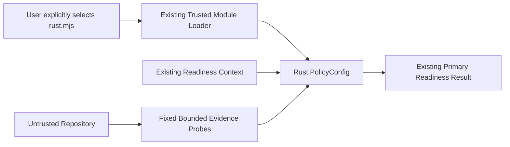
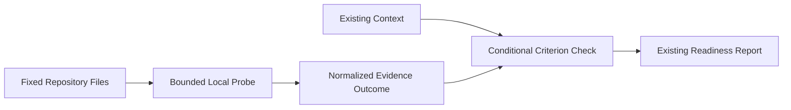

# Security Review: Rust Readiness Policy

**Status**: Accepted
**Date**: 2026-07-18
**Overall Risk**: Low
**Feature**: [spec.md](spec.md)
**Architecture**: [ar.md](ar.md)

## Linkage

This review covers only the Option A deliverable: a self-contained executable policy example. Tracks
B and C are future work and are not security requirements or outputs of 002.

## Feature Security Summary

The policy is explicitly trusted code loaded through `--policy`. It performs a constant number of
fixed-path metadata checks and at most one bounded read of the root Cargo manifest. It introduces no
production dependency, subprocess, network operation, filesystem write, model prompt, or new product
trust boundary.

The incremental risk is Low provided the example remains self-contained, read-only, bounded, and
failure-tolerant. Potential security findings discovered during earlier architecture exploration are
outside this feature and must remain in the private disclosure process; no reproduction detail is
stored here.

## Attack Surface Analysis

### Exposure Points

| Exposure                | Input                                        | Validation                                                                            |
| ----------------------- | -------------------------------------------- | ------------------------------------------------------------------------------------- |
| Policy module loader    | Explicit `.mjs` path supplied through CLI    | Existing trusted-code loader; not permitted from JSON-only repository config          |
| Fixed evidence probes   | Known files beneath supplied repository root | Constant allowlist, containment check, symbolic-link rejection, regular-file check    |
| Cargo lint header check | Root `Cargo.toml` text                       | 1 MiB limit, UTF-8 text handling, comment-line removal, anchored conservative pattern |
| Policy check context    | Existing root files, analysis, and app data  | Read-only use; no mutation or execution                                               |

### Attack Surface Diagram

### Exposure Checklist

- [x] Module trust is explicit and documented.
- [x] Candidate paths are fixed rather than repository-controlled.
- [x] Content read count and size are bounded.
- [x] No subprocess, network, write, or model surface is added.
- [x] Non-Rust behavior has a compatibility oracle.

## Data Flow Analysis

### Data Inventory

| Data                                | Classification          | Handling                                                             |
| ----------------------------------- | ----------------------- | -------------------------------------------------------------------- |
| Root file names                     | Internal                | Used only for readiness checks.                                      |
| Root Cargo manifest header text     | Confidential by default | Read locally within cap; never logged, persisted, or returned raw.   |
| Existing analysis/app fields        | Internal/Confidential   | Read from context; only status/reason/evidence projections returned. |
| Criterion result                    | Internal                | Existing readiness output contract.                                  |
| Credentials and environment secrets | Restricted              | Not read by any candidate path and never emitted.                    |
| Example policy source               | Public                  | Contains no repository-derived data or secrets.                      |

### Data Flow Diagram

## Trust Boundaries

1. User-selected executable policy module to AgentRC's trusted-code loader.
2. Untrusted repository files to bounded boolean evidence probes.
3. Existing readiness context to conditional criterion checks.

No remote-model, remote-service, or filesystem-write boundary is added.

## CIA Impact Assessment

| Dimension       | Rating | Rationale                                                                                   |
| --------------- | ------ | ------------------------------------------------------------------------------------------- |
| Confidentiality | Low    | One bounded fixed-path content read; raw content is not emitted.                            |
| Integrity       | Low    | Policy changes readiness only when explicitly selected; non-Rust fallback is characterized. |
| Availability    | Low    | Constant fixed probes and a 1 MiB read cap prevent unbounded policy work.                   |

## Known Risks and Mitigations

| Risk                                        | Severity     | Mitigation                                                                                               |
| ------------------------------------------- | ------------ | -------------------------------------------------------------------------------------------------------- |
| Executable policy can run arbitrary code    | Low/expected | Document trusted-code status; ship reviewed self-contained source; require explicit CLI selection.       |
| Path accidentally escapes repository        | Low          | Fixed allowlist plus normalized containment check.                                                       |
| Oversized Cargo manifest consumes resources | Low          | Reject content reads above 1 MiB.                                                                        |
| Commented header creates false evidence     | Low          | Remove comment-only lines and use anchored table-header matching.                                        |
| Unreadable/binary input crashes readiness   | Low          | Catch metadata/read/decode errors and treat as absent evidence.                                          |
| Policy weakens non-Rust results             | Medium       | Conditional replacements and normalized compatibility tests.                                             |
| Policy drifts from upstream built-ins       | Low          | Metadata/result characterization tests fail when baseline behavior changes.                              |
| Private security information is committed   | High         | Store no reproduction detail in specs, issues, tests, or PR text; use `SECURITY.md` privately after 002. |

## Security Requirements

| ID      | Requirement                                                                                                                                                | Traceability               | Verification                                                                      |
| ------- | ---------------------------------------------------------------------------------------------------------------------------------------------------------- | -------------------------- | --------------------------------------------------------------------------------- |
| SEC-001 | Policy checks MUST use only fixed repository-relative candidate paths and verify containment beneath `repoPath`.                                           | FR-012                     | Traversal and path-normalization unit tests.                                      |
| SEC-002 | Cargo content reads MUST reject symbolic links, require a regular file no larger than 1 MiB, validate the opened handle, and fail closed without throwing. | FR-012                     | Symlinked, oversized, unreadable, directory, malformed, and binary-like fixtures. |
| SEC-003 | The policy MUST perform no process execution, network access, filesystem writes, dynamic code loading, or environment-secret reads.                        | FR-013                     | Static source review and spies that fail on process/network/write calls.          |
| SEC-004 | The policy MUST use no external dependency or private AgentRC-core import.                                                                                 | FR-013                     | Import inspection and unchanged production lockfiles.                             |
| SEC-005 | Rust-only criteria MUST skip for non-Rust repositories, and replacements MUST preserve normalized non-Rust behavior.                                       | FR-004, FR-015             | Node and Python compatibility comparisons.                                        |
| SEC-006 | Raw Cargo content, host absolute paths, and secrets MUST NOT appear in criterion reason or evidence.                                                       | Constitution security rule | Canary scan over JSON and human output.                                           |
| SEC-007 | Documentation MUST identify module policies as trusted code and require explicit `--policy` use.                                                           | FR-016                     | Documentation contract test.                                                      |
| SEC-008 | Potential security findings outside Option A MUST remain private and MUST NOT be described in committed artifacts.                                         | Follow-up roadmap          | Pre-commit content review and private disclosure ownership outside this spec.     |

## Third-Party and Supply Chain

- No production package is added.
- The `.mjs` policy uses Node.js built-ins only.
- Production package and lockfile diffs must remain empty.
- Users must review copied executable policy source as trusted code, consistent with existing module
  policy guidance.

## Compliance Considerations

No new personal-data category, remote processor, authentication path, or persistence is introduced.
Existing repository confidentiality requirements still apply to local readiness output.

## Security Traceability

| Requirements    | Feature coverage                                 |
| --------------- | ------------------------------------------------ |
| SEC-001-SEC-002 | Fixed and bounded evidence probes                |
| SEC-003-SEC-004 | Dependency-free read-only policy boundary        |
| SEC-005         | Conditional fallback and Rust-only skip behavior |
| SEC-006         | Output redaction and normalized evidence         |
| SEC-007         | Trusted-code usage documentation                 |
| SEC-008         | Private handling of follow-up security work      |

## Security Review Actions

- [x] Low incremental risk accepted for the Option A design.
- [x] Verify every `SEC-*` requirement has an implementation task before coding.
- [ ] Name a private disclosure owner separately if Option C proceeds after 002.
- [x] Confirm no sensitive details appear in the final committed diff.
